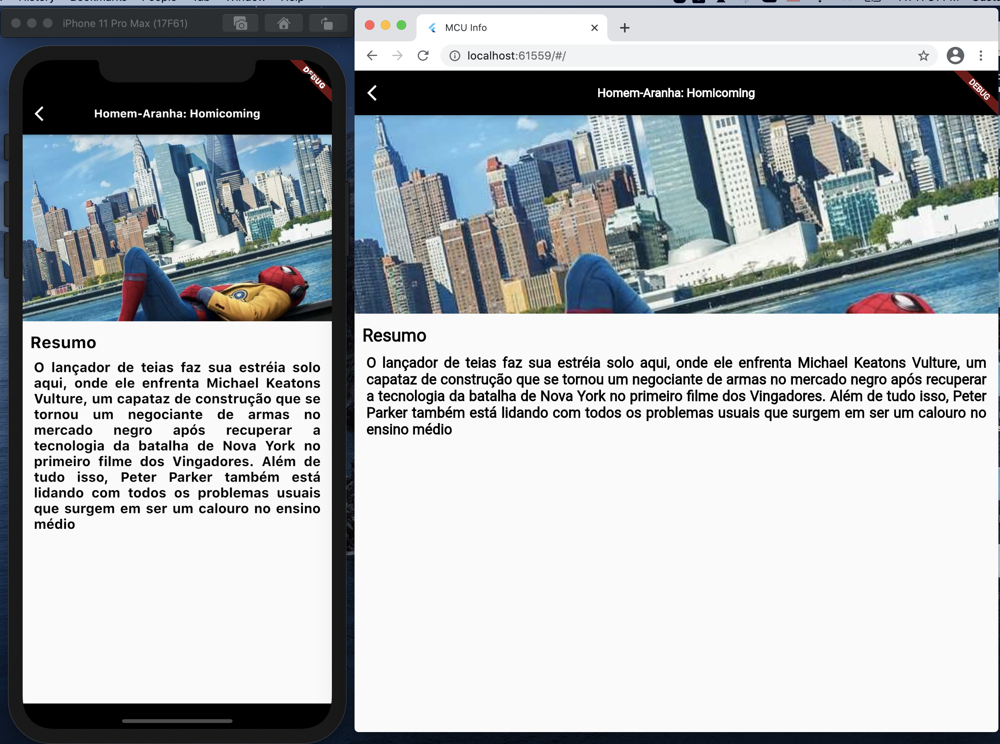
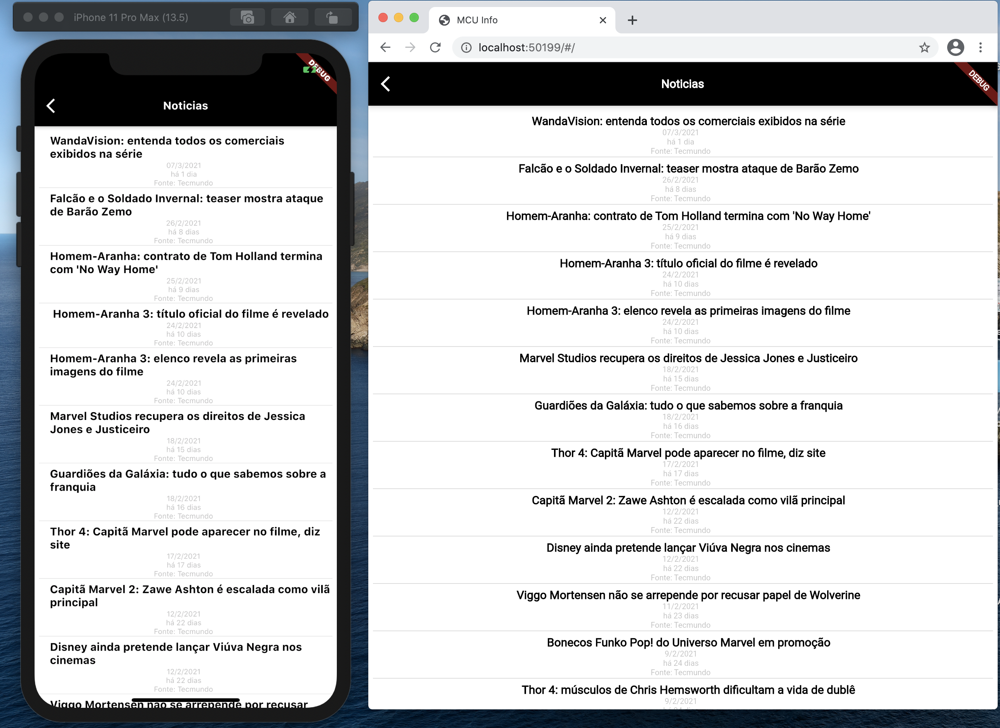
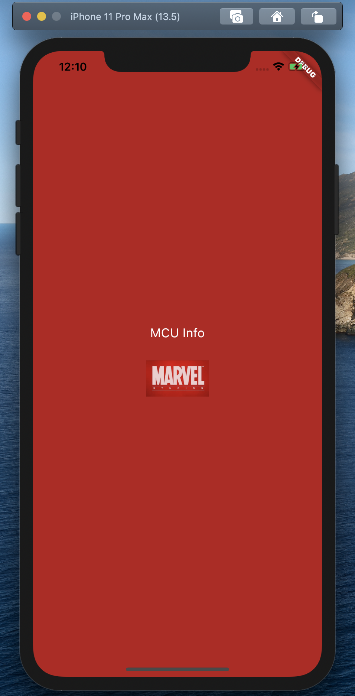

# mcu_app

This is a project that aims to make information from the Marvel cinematic universe easily available, in addition to practicing skills in mobile and web development in Flutter. In the future new features will be added. Feel free to join if you want. Soon I'll put a link to Play store and URl to Web. Link to Web version http://mcu-info.surge.sh/#/ .

## Screenshot

